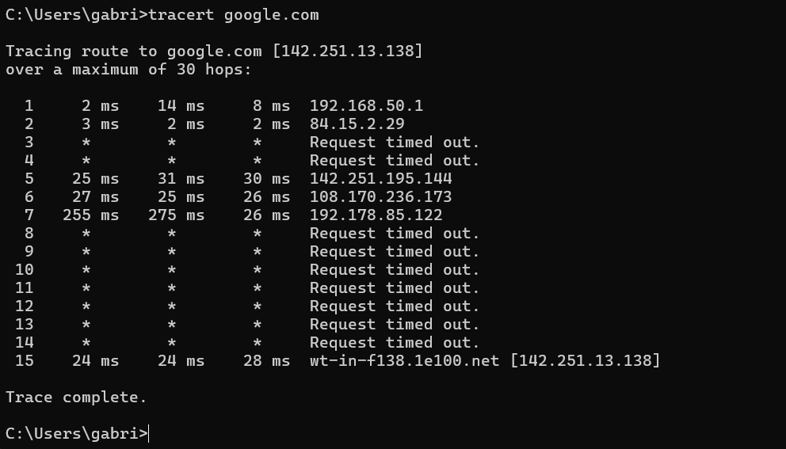
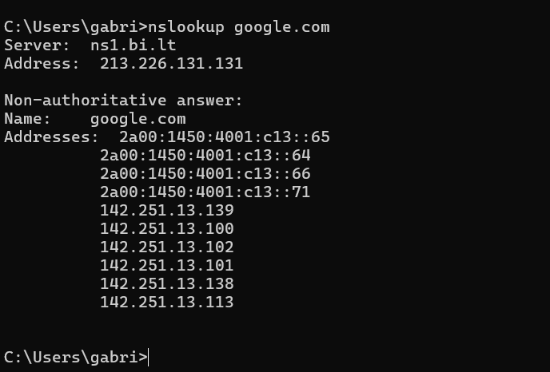
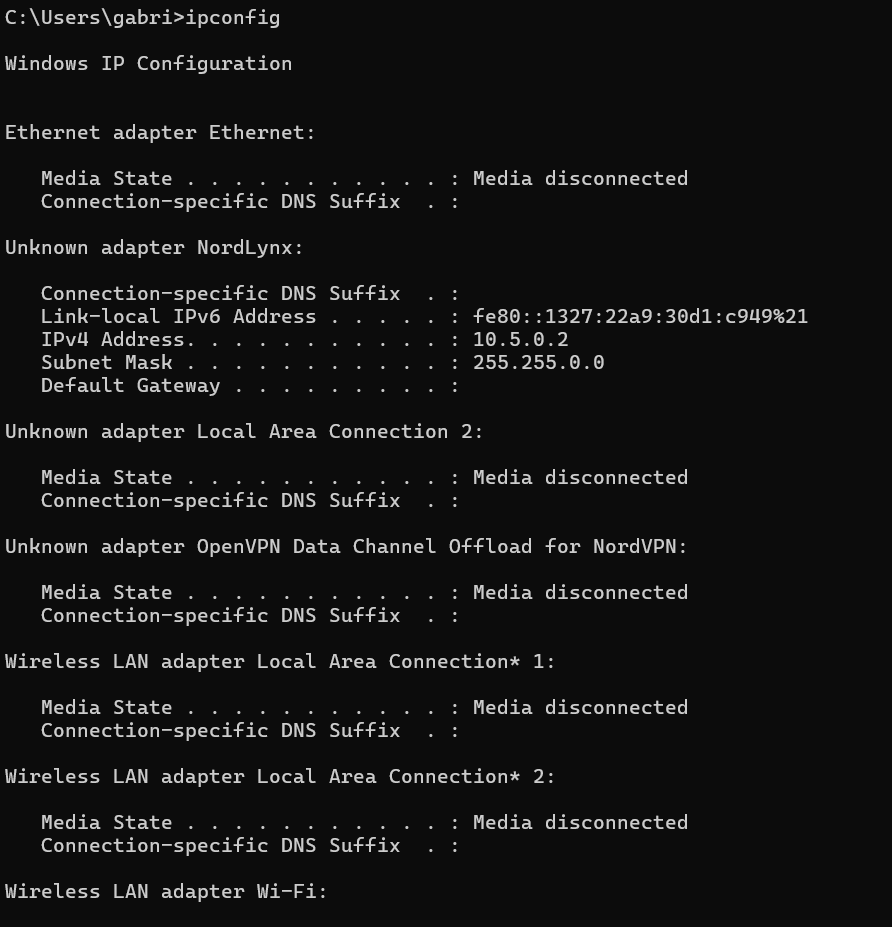

# Network Troubleshooting Lab

## Objective

Investigate basic connectivity and DNS issues using common network diagnostic tools.

## Tools Used

- Ping
- Traceroute
- Nslookup
- Ipconfig
- Windows Command Prompt

## Screenshots

### Ping Test

Successful connectivity confirmed by receiving replies from the target host.

### Traceroute Test

Traceroute used to review the route between the local device and the destination.

### DNS Lookup

Nslookup used to verify DNS resolution.

### Local Network Configuration

Ipconfig used to review local IP configuration and network adapter details.

## Findings

- Local device had active network connectivity.
- DNS resolution was functioning.
- Network path could be reviewed using traceroute.
- Findings were documented for escalation if required.

## Skills Demonstrated

- Network troubleshooting
- DNS investigation
- Connectivity testing
- Documentation
- Escalation awareness
