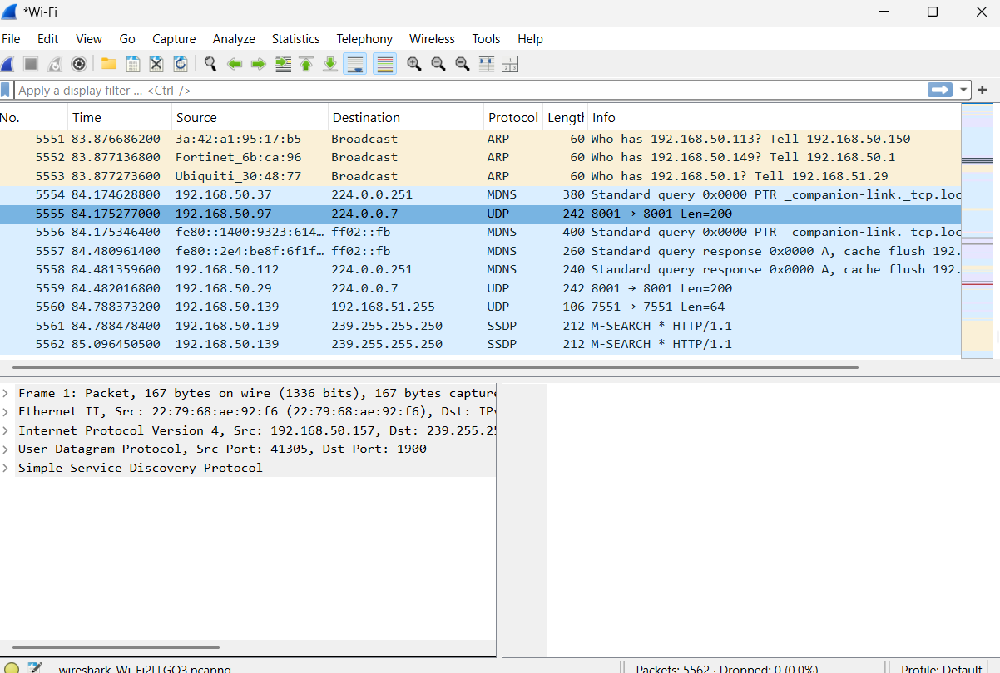

# Security Monitoring & Traffic Analysis Lab

## Objective

Capture and review basic network traffic using Wireshark.

## Tools Used

- Wireshark
- Windows
- Browser-generated network traffic

## Screenshot

### Wireshark Packet Capture

Wireshark was used to capture and review network packets during normal browsing activity.

## What Was Reviewed

- Source and destination IP addresses
- Protocols visible in traffic
- DNS traffic
- TCP/HTTPS communication
- Repeated connections

## Findings

- Network packets were successfully captured.
- Common protocols were identified.
- DNS and TCP/HTTPS traffic were reviewed.
- Observations were documented following a structured process.

## Skills Demonstrated

- Traffic analysis
- Security monitoring basics
- Network protocol awareness
- Documentation
- Incident investigation mindset
